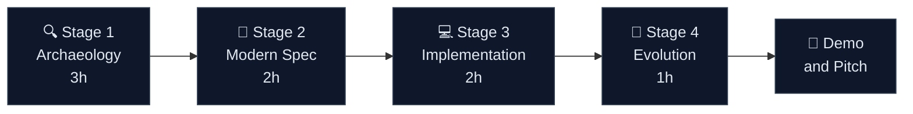

# 🚀 Team Repository Kit

<p align="center">
  
</p>

<h3 align="center">Hackathon DATACORP 2026 — Team Starter Kit</h3>

<p align="center">
  
  
  
  
  
  
</p>

> **📍 Start here** if you are a hackathon participant.
>
> 1. **First**: follow [`SETUP.md`](SETUP.md) to create your team's GitHub repo, configure Copilot, and install Spec-Kit + Specky (30 minutes).
> 2. **Then**: read [`TEAM-FLOW.md`](TEAM-FLOW.md) to understand how the 10 of you work together.
> 3. **Finally**: open your persona kit in `persona-kits/<your-role>/README.md`, then go to Stage 1 at `01-arqueologia/GUIDE.md`.

[Setup Guide](SETUP.md) · [Team Flow](TEAM-FLOW.md) · [The SIFAP Story](#-the-sifap-story) · [Your Mission](#-your-mission-in-8-hours) · [Your Team](#-your-team) · [Stage Flow](#%EF%B8%8F-the-four-stage-journey)

---

## 📑 Table of Contents

1. [The SIFAP Story](#-the-sifap-story)
2. [Why SIFAP Must Change](#%EF%B8%8F-why-sifap-must-change)
3. [Your Mission in 8 Hours](#-your-mission-in-8-hours)
4. [Your Team](#-your-team)
5. [The Four Stage Journey](#%EF%B8%8F-the-four-stage-journey)
6. [The 4 SDLC Agents](#-the-4-sdlc-agents)
7. [From Legacy to Modern](#%EF%B8%8F-from-legacy-to-modern)
8. [Folder Structure](#-folder-structure)
9. [How to Use This Kit](#%EF%B8%8F-how-to-use-this-kit)
10. [Related Repositories](#-related-repositories)
11. [References](#-references)

---

## 🎬 The SIFAP Story

Picture this. It is 1995. A small team of engineers at DATACORP builds a system to pay social benefits to millions of citizens. They pick the best tools available at the time: **Natural**, a language designed for fast data processing, and **Adabas**, a hierarchical database known for reliability. They name it **SIFAP**, the *Sistema Integrado de Folha de Pagamentos*.

The system works. It pays citizens on time, month after month. The people who built it move on. New people are hired. The business changes. Laws change. Payments rules change. Every few years, someone patches SIFAP to handle a new rule, a new benefit category, a new exception. Nobody rewrites it. Nobody dares to. It just keeps running.

Fast forward to **2026**. SIFAP is still running. It processes millions of payments every month. But it is not the quiet hero it used to be. It has become a burden.

- The original architects are long gone.
- The source code has abbreviations nobody remembers the meaning of.
- Every change requires a week of testing, because there are no automated tests.
- The mainframe licenses cost the company more every year.
- Citizens want to check their benefits from a phone. SIFAP has no API.
- Partners want to integrate. SIFAP has no modern endpoint.
- Operators still use green screen terminals. Nobody under 35 knows how to navigate them.

**That is where your team comes in.** You have 1 day, 100 developers, 10 teams, and a box full of AI tools. Your mission is to prove that legacy modernization, the kind that used to take 2 years and a consulting army, can now happen in hours, with the right approach.

Welcome to the Hackathon DATACORP 2026.

---

## ⚠️ Why SIFAP Must Change

<p align="center">
  
</p>

| # | Pain Point | Business Impact |
|---|------------|-----------------|
| 1️⃣ | **Knowledge silos** | A handful of people know how SIFAP works. When they leave, the company is exposed. |
| 2️⃣ | **Cryptic code** | 8 character abbreviations, no comments, no docs. Every change starts with archaeology. |
| 3️⃣ | **Zero tests** | Changes are gambles. A fix in one module silently breaks another from 15 years ago. |
| 4️⃣ | **Costly licenses** | Mainframe licenses consume budget that should fund innovation. |
| 5️⃣ | **No integrations** | Mobile, partners, modern channels. All blocked by the monolith. |

> 💡 **Analogy.** Legacy SIFAP is like a 30 year old family car that still runs but needs a full tank of gas, a carburetor adjustment every month, and only one mechanic in town can service it. Modernizing is not about buying a faster car. It is about trading it for a reliable electric vehicle the whole family can drive.

---

## 🎯 Your Mission in 8 Hours

Your team has one clear goal. Rebuild SIFAP with a modern stack, prove that AI assisted Spec Driven Development delivers, and ship something demo worthy by the end of the day.

| Deliverable | Format | Stage |
|-------------|--------|-------|
| 🗺️ **Legacy map and glossary** | Markdown in `01-arqueologia/` | Stage 1 |
| 📜 **Modern specification** | EARS requirements + ADRs in the **reference modern spec** (provided by facilitators) | Stage 2 |
| 💻 **Working prototype** | Java 21 + Next.js 15 code | Stage 3 |
| ☁️ **Infrastructure and CI/CD** | Terraform + GitHub Actions | Stage 4 |
| 🎤 **Final pitch** | 5 minute demo | End of day |

---

## 👥 Your Team

<p align="center">
  
</p>

Each team has 10 people. The facilitators provide **25 persona kits**. You can pick any combination that fits your team and the work you need to do.

### 🌟 Recommended Core (5 personas, 2 people each)

| Persona | Role | Primary Tool | Delivers |
|---------|------|-------------|---------|
| 🧠 **Tech Lead** | Architecture and decisions | Specky SDD + Copilot Chat | ADRs, reviews, alignment |
| ☕ **Backend Developer** | Services and APIs | Java 21 + Spring Boot | REST API, domain, services |
| ⚛️ **Frontend Developer** | Web experience | Next.js 15 + TypeScript | UI, pages, API integration |
| 🛠️ **DevOps Engineer** | Infra and pipelines | Terraform + GitHub Actions | IaC modules, CI/CD |
| 🧪 **QA Engineer** | Quality and coverage | Vitest + pytest | Test suite, quality gates |

> 🎒 **Need more specialized roles?** The `persona-kits/` folder has 25 kits including Product Owner, UX Designer, DBA, SRE, AppSec Engineer, Compliance Auditor, and more. Pick what your team needs.

---

## 🗺️ The Four Stage Journey

<p align="center">
  
</p>



| Stage | Folder | What your team does |
|-------|--------|---------------------|
| 🔍 **Archaeology** | [`01-arqueologia/`](01-arqueologia/) | Explore SIFAP, map rules, find the hidden mysteries |
| 📜 **Modern Spec** | [`02-spec-moderna/`](02-spec-moderna/) | Write EARS requirements, capture ADRs, design the target |
| 💻 **Implementation** | [`03-implementacao/`](03-implementacao/) | Build Java backend, Next.js frontend, PostgreSQL schema |
| 🚀 **Evolution** | [`04-evolucao/`](04-evolucao/) | Terraform to Azure, GitHub Actions pipeline, final demo |

---

## 🤖 The 4 SDLC Agents

If the persona-kits are the **vertical axis** — one kit per role — the 4 stage agents are the **horizontal axis** — one agent per stage of the day. Every persona uses every agent, but the spotlight shifts as the clock advances. Agents know *how* to modernize Natural/Adabas systems; they do *not* know anything specific about your legacy system. That knowledge emerges from your investigation.

| Agent | Stage | Mission | Kit |
|-------|-------|---------|-----|
| `@archaeologist-agent` | 1 — Archaeology | Read legacy code, extract rules, map dependencies, catalog mysteries | [`agent-kits/01-archaeologist/`](agent-kits/01-archaeologist/README.md) |
| `@architect-agent` | 2 — Modern Spec | Carve bounded contexts, write EARS, generate ADRs, design Modular Monolith | [`agent-kits/02-architect/`](agent-kits/02-architect/README.md) |
| `@builder-agent` | 3 — Implementation | Translate legacy to Java 21, generate JPA, write tests, build REST + Next.js | [`agent-kits/03-builder/`](agent-kits/03-builder/README.md) |
| `@evolution-agent` | 4 — Evolution | Write GitHub Issues for Copilot Agent, review AI PRs, set up CI/CD and IaC | [`agent-kits/04-evolution/`](agent-kits/04-evolution/README.md) |

See [`docs/persona-agent-matrix.md`](docs/persona-agent-matrix.md) for the full 10×4 mapping of who uses what.

See [`docs/4-agents-explained.md`](docs/4-agents-explained.md) for the anatomy of each agent.

---

## 🏗️ From Legacy to Modern

<p align="center">
  
</p>

> 💡 **Think of it as a kitchen renovation.** The legacy SIFAP is a kitchen from 1995: functional, but tight, hard to clean, with appliances only one brand still services. The modern SIFAP is an open, modular kitchen where every appliance speaks a standard protocol, and anyone can plug in new devices.

---

## 📂 Folder Structure

| 📁 Path | 🎯 Purpose |
|------|---------|
| [`SETUP.md`](SETUP.md) | 🚀 **Read first.** Step-by-step: create repo, configure Copilot, install Spec-Kit + Specky |
| [`TEAM-FLOW.md`](TEAM-FLOW.md) | 🤝 Daily timeline, handoffs, the 20-minute rule |
| [`personas/`](personas/) | 👤 The 10 persona cards — read your role |
| [`01-arqueologia/`](01-arqueologia/) | 🔍 Stage 1: legacy code archaeology guides and Copilot prompts |
| [`02-spec-moderna/`](02-spec-moderna/) | 📜 Stage 2: EARS specification templates and ADR scaffolds |
| [`03-implementacao/`](03-implementacao/) | 💻 Stage 3: implementation scaffolding and Copilot Agent prompts |
| [`04-evolucao/`](04-evolucao/) | 🚀 Stage 4: Terraform guides and CI/CD templates |
| [`cheat-sheets/`](cheat-sheets/) | ⚡ Quick reference cards: Copilot modes, Specky workflow, model routing |
| [`persona-kits/`](persona-kits/) | 🤖 25 Copilot agent kits, each with agents, prompts, skills, and a README |
| [`agent-kits/`](agent-kits/) | 🤖 4 SDLC stage agents (archaeologist, architect, builder, evolution) |
| [`plugins/`](plugins/) | 🔌 Shared Copilot plugins (GitHub Issues, Azure Boards sync) |
| [`scripts/`](scripts/) | 🛠️ `setup.sh` (bootstrap) and `check.sh` (run all CI gates locally) |
| [`docs/`](docs/) | 📚 Team-curated docs: ADRs, glossary, runbook, agent guides |
| [`assets/`](assets/) | 🖼️ SVG illustrations used across this kit |
| [`.github/`](.github/) | ⚙️ Issue templates, PR template, Copilot instructions, workflows |
| [`.devcontainer/`](.devcontainer/) | 📦 Pre-configured dev environment (Java 21, Node 20, Docker) |

---

## 🛠️ How to Use This Kit

### 📦 Reference materials provided by facilitators

The stage guides mention these external folders. Facilitators distribute them at the start of the event, or you run `./scripts/setup.sh` to clone them as symlinks. Either way, the paths in the guides will work.

| Stage | Folder | Purpose |
|:---:|---|---|
| 1 | `legacy/` | Natural programs, Adabas DDMs, legacy docs ([sifap-legacy](https://github.com/paulasilvatech/sifap-legacy)) |
| 2 | — | Reference modern specification (read on GitHub: **reference modern spec** (shared by facilitators)) |
| 3 | `prototype/` | Reference prototype (Java + Next.js) |
| 4 | `infra/` | Reference Terraform modules for Azure |

### 🚀 Getting started

**Full step-by-step setup is in [`SETUP.md`](SETUP.md)** — covers GitHub repo creation, Copilot activation, Spec-Kit + Specky installation, branch strategy, and the 12-item smoke test.

Quick summary (full instructions in `SETUP.md`):

```bash
# 1. Create your team's GitHub repo (one person, once)
gh repo create paulasilvatech/hackathon-team-XX --private --add-readme

# 2. Bootstrap from this kit
git clone https://github.com/paulasilvatech/hackathon-datacorp-team-kit.git kit
git clone https://github.com/paulasilvatech/hackathon-team-XX.git
cd hackathon-team-XX
cp -R ../kit/. . && rm -rf .git
git init -b main
git remote add origin https://github.com/paulasilvatech/hackathon-team-XX.git

# 3. Bootstrap script (clones sifap-legacy, sets up symlinks)
./scripts/setup.sh

# 4. Open in VS Code with the dev container
code .
# Then: Ctrl+Shift+P > "Dev Containers: Reopen in Container"
```

> ⚠️ **Heads up.** The reference prototype and Terraform modules are delivered by facilitators at the start of Stages 3 and 4 respectively. Do not attempt to fetch them from this repository.

### 🎯 Recommended reading order

1. 🚀 [`SETUP.md`](SETUP.md) — get your environment ready (30 min)
2. 🤝 [`TEAM-FLOW.md`](TEAM-FLOW.md) — understand how the 10 of you collaborate
3. 📖 Your persona card in [`personas/<your-role>.md`](personas/)
4. 🤖 Your Copilot agent kit in [`persona-kits/<your-role>/README.md`](persona-kits/)
5. ⚡ Cheat sheets in [`cheat-sheets/`](cheat-sheets/) (keep them open in a tab)
6. 🔍 Stage 1 guide in [`01-arqueologia/GUIDE.md`](01-arqueologia/GUIDE.md)

---

## 🔗 Related Repositories

| Repository | Purpose |
|-----------|---------|
| [hackathon-datacorp-team-kit](https://github.com/paulasilvatech/hackathon-datacorp-team-kit) | 🎒 This repository — team starter kit |
| [sifap-legacy](https://github.com/paulasilvatech/sifap-legacy) | 🗄️ Read-only legacy SIFAP code (Natural + Adabas) for Stage 1 |

---

## 📚 References

Reference materials live in the main event repository and are shared by facilitators.

| 📖 Resource | 🎯 What you get |
|-------------|-----------------|
| Hackathon Blueprint | Event plan, schedule, rubric |
| SIFAP Modern Specification | Complete EARS spec for the target system |
| Reference Prototype | Working Java + Next.js implementation |
| Facilitator Playbook | Session scripts, coaching cues, fallback plans |

---

## Navigation

| Previous | Home | Next |
|---|---|---|
| [Team Flow](TEAM-FLOW.md) | This kit | [Stage 1: Archaeology](01-arqueologia/GUIDE.md) |

> Authored by Paula Silva, AI-Native Software Engineer, Americas Global Black Belt at Microsoft. Version 1.3.0, April 2026.
