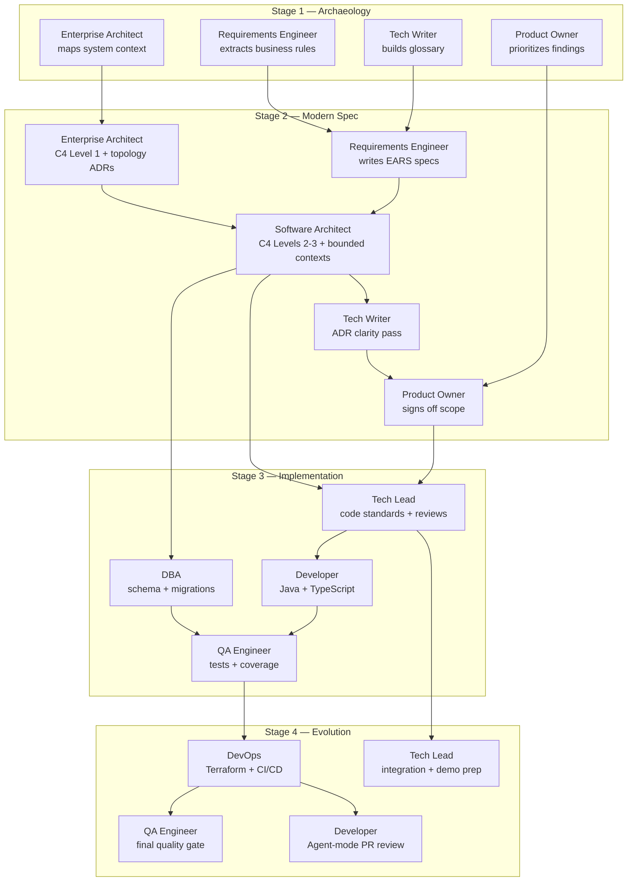

# Team Flow — How the 10 of You Work Together

> **Read this before you read your persona card.** Your individual role makes sense only inside the team flow.

A team of 10 with 10 different personas only works if you all know:

1. **When you start** working (not everyone codes at 09:00).
2. **Who you receive from** (your inputs come from another persona).
3. **Who you hand off to** (your output unblocks another persona).
4. **When you ask for help** (the 20-minute rule).

This document answers all four. Pin it to your screen.

---

## 1. The Daily Timeline (8 hours)

```
09:00  09:30                   12:00         13:00              16:00     17:00
  |-----|----------------------|              |-----|------------|---------|
  |  S1   Stage 1 Archaeology  |   LUNCH      | S2  Spec       S3 Implem  S4 Evol
```

| Time | Block | Lead Personas | Everyone Else |
|------|-------|---------------|---------------|
| **09:00–09:30** | Opening + setup | Tech Lead | Read TEAM-FLOW.md, your persona card, copy your kit |
| **09:30–10:30** | Stage 1 — Archaeology | Tech Writer + Requirements Engineer + Enterprise Architect | Pair-read legacy code, mine your domain |
| **10:30–11:30** | Stage 1 — Synthesis | Requirements Engineer + Product Owner | Consolidate findings, prioritize what to modernize |
| **11:30–12:00** | **Handoff #1**: legacy → spec | RE + Architects | PO confirms priorities |
| **12:00–13:00** | LUNCH | — | — |
| **13:00–14:30** | Stage 2 — Modern Spec | Requirements Engineer + Software Architect | Write EARS, draw C4, write ADRs |
| **14:30–14:45** | **Handoff #2**: spec → code | Software Architect | Tech Lead + Developer pick up the spec |
| **14:45–17:00** | Stage 3 — Implementation | Developer + DBA + QA | Code, test, migrate, integrate |
| **17:00–17:15** | **Handoff #3**: code → ops | Tech Lead | DevOps takes over, QA continues |
| **17:15–18:00** | Stage 4 — Evolution | DevOps + Tech Lead | Terraform, CI/CD, Agent-mode delegation |
| **18:00–18:30** | Demo prep | Tech Lead + Product Owner | Everyone rehearses 30 seconds |
| **18:30–19:10** | **Demos** (10 teams × 4 min) | Whole team | — |
| **19:10–19:50** | Retrospective | — | Each persona fills their form |
| **19:50–20:00** | Closing | — | — |

---

## 2. The Handoff Map (Swimlanes)



### How to read this map

- **Arrows are blocking dependencies.** If RE has not delivered EARS specs, SA cannot finalize C4 L2.
- **Vertical position is time.** Higher = earlier.
- **Handoffs cross stage boundaries.** Each handoff needs a 5-minute "walkthrough" between the two personas.

---

## 3. First 30 Minutes — Per-Persona Checklist

At 09:00, **every persona** does the same 4 things in the first 30 minutes. Then specialization starts.

| Step | Action | Time |
|------|--------|------|
| 1 | Read [`TEAM-FLOW.md`](TEAM-FLOW.md) (this file) | 10 min |
| 2 | Read your card in [`personas/XX-your-role.md`](personas/) | 10 min |
| 3 | Copy your Copilot kit: `cp -r persona-kits/XX-your-role/.github/* .github/` | 5 min |
| 4 | Open Copilot Chat, run a smoke-test prompt from your card | 5 min |

After 09:30, the **lead personas** for Stage 1 start work; the others prepare for their stage.

### What each persona does in the first 30 minutes after onboarding

| Persona | 09:30 action |
|---------|--------------|
| Product Owner | Read the **Hackathon Blueprint** (provided separately by the facilitators) + decide initial scope priorities |
| Requirements Engineer | Open `legacy/natural-programs/` and start the rule catalog |
| Enterprise Architect | Open `legacy/legacy-docs/` and start C4 Level 1 |
| Software Architect | Pair with EA on system context; prepare bounded-context candidates |
| Technical Lead | Set team conventions: branch strategy, PR template, definition of done |
| Developer | Read `prototype/README.md`; run `docker compose up` |
| DBA | Open `legacy/adabas-ddms/` and map fields to PostgreSQL |
| QA Engineer | Read `prototype/backend/src/test/`; plan test strategy |
| DevOps Engineer | Open `infra/` and read modules; plan IaC approach |
| Tech Writer | Open `01-arqueologia/glossary.md` and start the glossary template |

---

## 4. The 20-Minute Rule

> **If you are stuck on the same problem for 20 minutes, stop and ask.**

The rule applies to everyone. Asking is not weakness; silent struggle is.

### Escalation ladder

| Stuck for | Talk to |
|-----------|---------|
| 5 min | Try Copilot Chat with a different framing |
| 10 min | Talk to your direct upstream/downstream persona (see swimlane map) |
| 20 min | Talk to the Technical Lead (if they're stuck, talk to a facilitator) |
| 30 min | Raise your hand for a facilitator (blue-cord) |

### What to say when you escalate

Use this 3-line format:

```
1. Goal:    What I'm trying to achieve
2. Tried:   What I already attempted (with results)
3. Block:   What's stopping me right now
```

Bad escalation: *"This isn't working."*

Good escalation: *"Goal: validate CPF in `BeneficiaryService`. Tried: regex check + Copilot suggestion (both fail on edge case 0000000000). Block: not sure if mod-11 algorithm should reject all-zeros explicitly."*

---

## 5. Definition of Done — Per Handoff

Each of the 3 major handoffs has a clear contract.

### Handoff #1: Legacy → Spec (end of Stage 1)

**Owner:** Requirements Engineer
**Receivers:** Software Architect, Tech Lead

| Artifact | Located at | Done means |
|----------|-----------|------------|
| Glossary | `01-arqueologia/glossary.md` | ≥ 30 terms with definitions |
| Business rules catalog | `01-arqueologia/business-rules-catalog.md` | ≥ 15 rules with source program references |
| Dependency map | `01-arqueologia/dependency-map.md` | Mermaid diagram covering all 15 Naturals |
| Mysteries found | `01-arqueologia/mysteries-found.md` | ≥ 5 hidden rules identified with evidence |

### Handoff #2: Spec → Code (end of Stage 2)

**Owner:** Software Architect
**Receivers:** Technical Lead, Developer, DBA

| Artifact | Located at | Done means |
|----------|-----------|------------|
| EARS specifications | `02-spec-moderna/` (per Specky) | ≥ 12 requirements with REQ-IDs |
| C4 diagrams | `02-spec-moderna/diagrams/` | Levels 1, 2, 3 in Mermaid |
| ADRs | `02-spec-moderna/ADRs/` | ≥ 3 ADRs (modular monolith, persistence, auth) |
| Scope sign-off | Recorded in PR | Product Owner approved scope |

### Handoff #3: Code → Ops (end of Stage 3)

**Owner:** Technical Lead
**Receivers:** DevOps, QA

| Artifact | Located at | Done means |
|----------|-----------|------------|
| Working backend | `prototype/backend/` | `mvn test` green; OpenAPI documented |
| Working frontend | `prototype/frontend/` | `npm test` green; main flows usable |
| Migrations | `backend/src/main/resources/db/migration/` | Flyway scripts numbered; idempotent |
| Coverage report | CI artifact | Backend ≥ 70%, frontend ≥ 60% lines |

---

## 6. Persona Pairings — Who Pairs With Whom

Some personas are individual contributors. Some pair naturally. Use this guide to spend less time figuring out collaboration.

| Pair | When to pair | What they produce together |
|------|--------------|----------------------------|
| Requirements Engineer + Tech Writer | Stage 1 entire | Glossary + rule catalog |
| Enterprise Architect + Software Architect | Stage 2 first hour | C4 Levels 1, 2, 3 |
| Software Architect + Technical Lead | Stage 2 → Stage 3 boundary | Architecture handoff walkthrough |
| Developer + DBA | Stage 3 first hour | Schema + first migration |
| Developer + QA | Stage 3 entire | Tests-first or shortly after |
| QA + DevOps | Stage 4 first 30 min | Pipeline coverage gates |
| Product Owner + Tech Lead | Demo prep | Demo script |

---

## 7. Communication Patterns

| Pattern | When | Example |
|---------|------|---------|
| **Stand-up** | At each stage transition (4×) | 2-min round: "I finished X, doing Y, blocked by Z" |
| **Pair check-in** | Every 30 min within a stage | "Are we still aligned?" |
| **PR comments** | Async between personas | Tag the receiving persona explicitly |
| **Quiet hour** | Last 30 min of Stage 3 | No meetings; everyone codes/tests |

---

## 8. Anti-Patterns (Don't Do This)

| ❌ Anti-pattern | ✅ Do instead |
|----------------|---------------|
| One person writes everything in stages 1+2 alone | Lead personas drive, but the rest contribute concrete artifacts |
| Skipping handoffs — "I'll figure out their part too" | 5-minute handoff walkthrough at every transition |
| Code merged without review by Tech Lead | Every PR has at least one persona-pair review |
| QA waits until end of Stage 3 to start | QA writes test stubs as soon as REQ-IDs exist |
| Tech Writer waits to be asked | Tech Writer pulls ADRs and READMEs continuously |
| Product Owner disappears after Stage 1 | PO validates demo and scope at every handoff |

---

## 9. Quick Reference

```
Stuck?               → 20-minute rule (see §4)
Need to hand off?    → Done-criteria (see §5)
Pair partner?        → Pairings table (see §6)
Where's my work?     → Folder by stage (01-arqueologia, 02-spec-moderna, …)
Which Copilot mode?  → cheat-sheets/copilot-3-modes.md
Which model?         → cheat-sheets/model-routing.md
Which Specky agent?  → cheat-sheets/specky-workflow.md
```

---

## Navigation

| Parent | Home |
|--------|------|
| [Team Kit](README.md) | [Workspace Root](../README.md) |

— Paula
