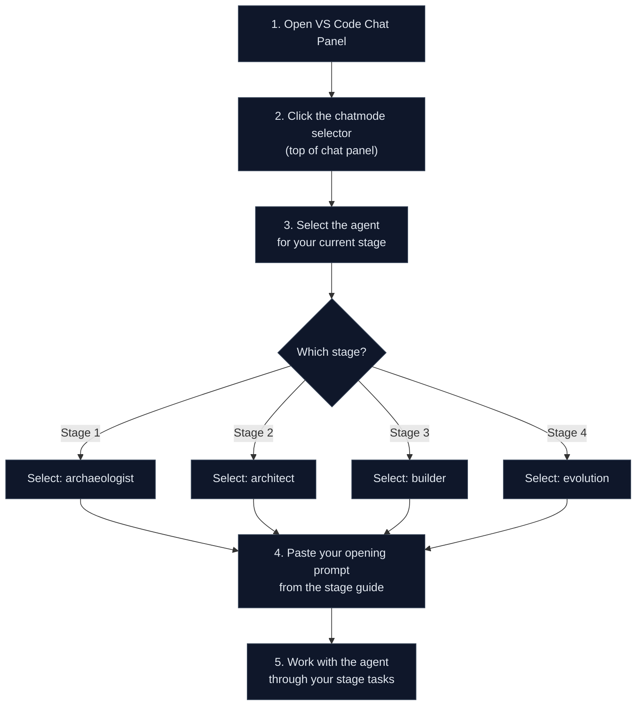

# Agent Kits — 4 SDLC Stage Agents

> If the persona-kits are **columns** — one per role — then the agent kits are **rows** — one per stage of the day. Every persona uses every agent, but the spotlight shifts as the clock advances.

The 25 persona-kits tell each person *what they own*. The 4 agent kits tell the team *how to work together in this stage*. They are complementary axes of the same coordinate system.

## The 4 Agents

| Agent | Stage | Mission | Chatmode | Model |
|-------|-------|---------|----------|-------|
| [`@archaeologist-agent`](01-archaeologist/README.md) | 1 — Archaeology | Read legacy code, extract rules, map dependencies, catalog mysteries | [`archaeologist`](../.github/chatmodes/archaeologist.chatmode.md) | Claude Opus 4.7 |
| [`@architect-agent`](02-architect/README.md) | 2 — Modern Spec | Carve bounded contexts, write EARS, generate ADRs, design Modular Monolith | [`architect`](../.github/chatmodes/architect.chatmode.md) | Claude Opus 4.7 |
| [`@builder-agent`](03-builder/README.md) | 3 — Implementation | Translate legacy patterns to Java 21, generate JPA from FDT, write tests, build REST + Next.js | [`builder`](../.github/chatmodes/builder.chatmode.md) | Claude Sonnet 4.6 |
| [`@evolution-agent`](04-evolution/README.md) | 4 — Evolution | Write GitHub Issues for Copilot Agent, review AI-generated PRs, set up CI/CD and IaC | [`evolution`](../.github/chatmodes/evolution.chatmode.md) | Claude Sonnet 4.6 |

## Persona × Agent Matrix

Every persona uses every agent, with varying intensity. **PROTAGONIST** drives the agent during their stage. **Secondary** actively contributes. **Observer** follows along.

| Persona | @archaeologist | @architect | @builder | @evolution |
|---------|---------------|------------|----------|------------|
| Product Owner | Observer | Secondary | Observer | Secondary |
| Requirements Engineer | **PROTAGONIST** | Secondary | Observer | Observer |
| Enterprise Architect | Secondary | Secondary | Observer | Observer |
| Software Architect | Observer | **PROTAGONIST** | Secondary | Observer |
| Technical Lead | Observer | Secondary | Secondary | **PROTAGONIST** |
| Developer | Observer | Observer | **PROTAGONIST** | Secondary |
| DBA | Secondary | Observer | Secondary | Observer |
| QA Engineer | Observer | Observer | Secondary | Secondary |
| DevOps Engineer | Observer | Observer | Secondary | Secondary |
| Tech Writer | Secondary | Observer | Observer | Secondary |

For detailed per-cell guidance, see [`../docs/persona-agent-matrix.md`](../docs/persona-agent-matrix.md).

## How to Activate an Agent

## The No-Silver-Platter Rule

These agents know **how** to modernize Natural/Adabas systems in general. They do **not** know anything about your specific legacy system. The business rules, data structures, and mysteries of your system must emerge from your team's investigation. Agents work **with** you, not **for** you.

---

| Previous | Home | Next |
|----------|------|------|
| [Persona Kits](../persona-kits/) | [Team Kit Home](../README.md) | [Docs](../docs/) |
