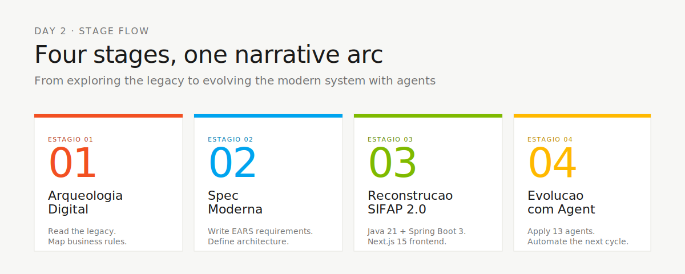

# 🧾 Cheat Sheets

> One-page quick-reference cards designed to be printed and placed on each team's table during the hackathon. Think of them as the pocket guide your squad will actually use when the clock is ticking.

  

---

## 📑 Table of Contents

1. [Why Cheat Sheets](#-why-cheat-sheets)
2. [Contents](#-contents)
3. [How to Use](#-how-to-use)
4. [Navigation](#-navigation)

---

## 💡 Why Cheat Sheets

The SIFAP modernization journey moves fast. Teams do not have time to scroll through docs while pairing with Copilot. These printable cards answer the three questions we see every hackathon:

| ❓ Question | 🗂️ Card |
|---|---|
| "Which Copilot mode should I use right now?" | `copilot-3-modes.md` |
| "Where am I in the Specky pipeline?" | `specky-workflow.md` |
| "Which model should I pick for this task?" | `model-routing.md` |

---

## 📚 Contents

| 🏷️ File | 📖 Topic | 🎯 Best For |
|------|-------|-------------|
| `copilot-3-modes.md` | Chat, Edits, and Agent modes | Any team member |
| `specky-workflow.md` | 10-phase SDD pipeline at a glance | Tech Lead, Architect |
| `model-routing.md` | Which AI model for each task type | Everyone deciding prompts |

---

## 🖨️ How to Use

1. Print each card at A4 landscape (or keep digital copies open on a second monitor).
2. Tape the `copilot-3-modes.md` card where every member can see it.
3. Consult `specky-workflow.md` whenever a stage transition happens.
4. Use `model-routing.md` before writing any long prompt, it saves tokens and time.

---

## 🧭 Navigation

| Previous | Home | Next |
|---|---|---|
| ← [04-evolucao](../04-evolucao/README.md) | [Kit Root](../README.md) | [Copilot Modes](./copilot-3-modes.md) → |

> Author: Paula Silva, AI-Native Software Engineer, Americas Global Black Belt at Microsoft.
