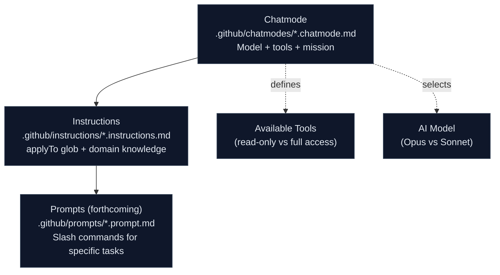

# The 4 SDLC Agents — Explained

This document explains the design rationale behind the 4 stage agents, how they are implemented as VS Code chatmodes + instruction files, and why they deliberately refuse to pre-solve the team's legacy system.

## Why 4 Agents (Not 7, Not 1)

The hackathon has 4 stages. Each stage has a distinct cognitive mode:

| Stage | Cognitive Mode | Agent |
|-------|---------------|-------|
| 1 — Archaeology | **Read and catalog** (divergent exploration) | `@archaeologist-agent` |
| 2 — Modern Spec | **Structure and decide** (convergent design) | `@architect-agent` |
| 3 — Implementation | **Build and verify** (generative execution) | `@builder-agent` |
| 4 — Evolution | **Dispatch and review** (operational orchestration) | `@evolution-agent` |

We considered finer splits (separate agents for backend vs. frontend in Stage 3, separate agents for IaC vs. CI/CD in Stage 4) but rejected them. In a time-boxed hackathon, agent-switching has a cognitive cost. Four agents — one per stage — minimizes context-switching while preserving specialization.

We also considered a single all-purpose agent but rejected it because:

- A single agent cannot enforce read-only constraints in Stage 1 while allowing edits in Stage 3
- Model routing (Opus for reasoning, Sonnet for generation) requires separate chatmode definitions
- Stage-specific anti-patterns (e.g., "don't write code in Stage 1") are cleaner when each agent owns its own constraints

## Anatomy of Each Agent

Each agent is composed of three layers:



### Layer 1: Chatmode (`.github/chatmodes/`)

The chatmode YAML frontmatter defines:

- **`tools`** — what the agent can do (e.g., `archaeologist` has no `editFiles`)
- **`model`** — which AI model powers the agent
- **`description`** — one-line purpose shown in the VS Code UI

The Markdown body contains the agent's full instructions: mission, principles, knowledge base, and anti-patterns.

### Layer 2: Instructions (`.github/instructions/`)

Instruction files activate automatically based on `applyTo` glob patterns:

| File | Fires When |
|------|-----------|
| `natural-adabas.instructions.md` | Opening `*.nat`, `*.cpy`, `*.ddm`, or anything in `legacy/` |
| `modular-monolith.instructions.md` | Opening Java source files or Maven/Gradle build files |
| `frontend-spec.instructions.md` | Opening TypeScript/TSX files or anything in `app/` or `components/` |

Instructions provide domain knowledge (how to read Natural code, how to structure a Modular Monolith, frontend conventions) without requiring the team to ask for it. They are context-sensitive reference material.

### Layer 3: Prompts (forthcoming)

Prompt files (`.github/prompts/*.prompt.md`) will provide slash commands like `/dig`, `/write-ears`, `/gen-entity`, and `/write-issue`. These are the specific actions teams invoke within each agent. Prompt files will be added in a follow-up task.

## The No-Silver-Platter Rule

The most important design constraint: **agents know HOW to modernize, not WHAT to modernize.**

| The agents know... | The agents do NOT know... |
|---|---|
| How to read Natural CALLNAT chains | Which specific programs exist in the team's legacy folder |
| How EARS notation works | What requirements the team's system needs |
| How to map Adabas FDT to JPA | What the team's DDMs contain |
| How to structure a Modular Monolith | What bounded contexts are appropriate |
| How to write GitHub Issues for Copilot Agent | What issues the team needs to create |

This is deliberate. The hackathon is a learning exercise. If agents pre-solved the modernization challenge, teams would copy-paste instead of think. The value is in the journey — the discoveries, the debates, the "aha" moments when a mysterious subroutine suddenly makes sense.

When an agent is asked for system-specific answers, it redirects: "Show me the code. Let's read it together."

## How Agents and Persona-Kits Coexist

The 25 persona-kits (in `persona-kits/`) are the **vertical axis** — they define what each role owns, delivers, and hands off. Each persona has a pre-configured Copilot agent, prompts, and skills tailored to their responsibilities.

The 4 stage agents (in `agent-kits/`) are the **horizontal axis** — they define how the team works together at each stage of the day. Every persona uses every agent, but with different intensity.

```
                Stage 1        Stage 2        Stage 3        Stage 4
              Archaeology    Modern Spec   Implementation   Evolution
Persona 1    ├───────────────┼──────────────┼───────────────┼──────────┤
Persona 2    ├───────────────┼──────────────┼───────────────┼──────────┤
  ...        │     ...       │    ...       │    ...        │   ...    │
Persona 10   ├───────────────┼──────────────┼───────────────┼──────────┤
```

A developer reads their persona card to know *what they own*. They read the agent kit for the current stage to know *how to work right now*. Both are needed.

## Model Routing Rationale

| Agent | Model | Why |
|-------|-------|-----|
| `@archaeologist-agent` | Claude Opus 4.7 | Deep reading requires extended thinking — tracing call chains, interpreting packed decimal math, recognizing 30-year-old patterns |
| `@architect-agent` | Claude Opus 4.7 | Structuring bounded contexts and validating EARS requirements demands strong reasoning over ambiguous inputs |
| `@builder-agent` | Claude Sonnet 4.6 | Code generation benefits from Sonnet's speed and quality balance — high throughput with strong correctness |
| `@evolution-agent` | Claude Sonnet 4.6 | Issue writing and PR review are structured tasks where Sonnet excels; Haiku handles compact sub-tasks like label suggestions |

The principle: **Opus for reading and reasoning, Sonnet for building and reviewing.** This optimizes both quality and speed within the hackathon's time constraints.

## References

- Agent kit READMEs: [`agent-kits/`](../agent-kits/README.md)
- Persona-agent matrix: [`docs/persona-agent-matrix.md`](persona-agent-matrix.md)
- Chatmode files: [`.github/chatmodes/`](../.github/chatmodes/)
- Instruction files: [`.github/instructions/`](../.github/instructions/)

---

| Previous | Home | Next |
|----------|------|------|
| [Persona-Agent Matrix](persona-agent-matrix.md) | [Team Kit Home](../README.md) | [Agent Kits](../agent-kits/README.md) |
