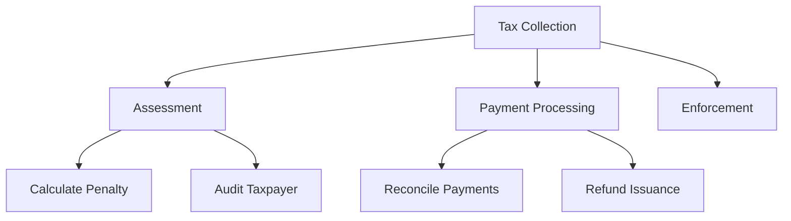

# Capability Map

## When to invoke
- "Build a capability map for the payments domain."
- "Where do two teams overlap in ownership?"
- "Which capabilities are core, which are commodity?"

## Concept

A **capability** is *what* the business does, not *how*. Capabilities are stable (decade-scale); applications and processes are volatile.

## Structure (3 levels)
- **L1**: Top-level business area (e.g., "Tax Collection", "Customer Service").
- **L2**: Major sub-functions (e.g., "Tax Assessment", "Payment Processing").
- **L3**: Specific capabilities (e.g., "Calculate penalty interest", "Reconcile payments").

Rule of thumb: 8-12 L1 capabilities for a medium enterprise.

## Steps
1. **Start with outcomes**, not org chart. "What does this business do for its customers?"
2. **Decompose top-down** to L3 (stop when a capability maps to a single accountable owner).
3. **Tag each capability**:
   - **Core**: differentiates, build in-house.
   - **Supporting**: necessary, buy or configure.
   - **Commodity**: undifferentiated, outsource or SaaS.
4. **Overlay systems**: which application(s) realise each L3 capability. Look for:
   - Duplicates (two systems doing the same thing)
   - Gaps (capability with no owner)
   - Monoliths (one system covering many L1s)
5. **Overlay investment**: where is the money going vs. where is the differentiation?

## Output template
```markdown
## Capability Map - <Domain>

### L1: <Top area>
#### L2: <Sub-function>
- **<L3 capability>** [Core|Supporting|Commodity]
  - Owner: <team>
  - Systems: <app1>, <app2>
  - Maturity: 1-5
  - Investment: $$$
```

## Mermaid example


## Quality gate
Every L3 capability must have exactly one accountable owner and a Core/Supporting/Commodity tag.
