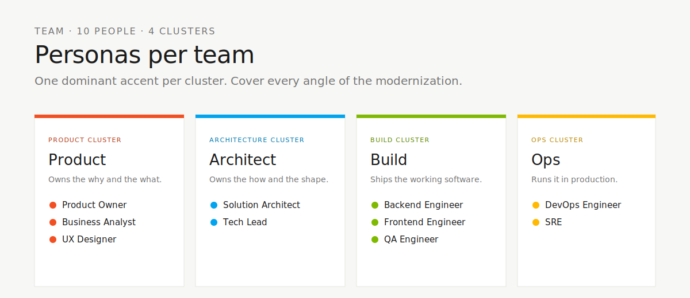

# 🎭 Persona Kits

> A hackathon team is not a homogenous squad. Different roles need different prompts, different agents, different Copilot setups. This folder contains 25 role-tailored kits so every hat in the room has a matching Copilot configuration.

<p align="center">
  
</p>

---

## 📑 Table of Contents

1. [Why Personas Matter](#-why-personas-matter)
2. [What Each Kit Contains](#-what-each-kit-contains)
3. [The 25 Personas](#-the-25-personas)
4. [How to Activate a Persona](#-how-to-activate-a-persona)
5. [Navigation](#-navigation)

---

## 🎯 Why Personas Matter

The legacy SIFAP system has touched every discipline in the organization over 30 years. Modernizing it touches every discipline again. A Product Owner frames value. A DBA protects data. An SRE keeps lights on. A DevRel tells the story.

If all of them use the same generic Copilot prompts, they will all get the same generic output. Persona kits solve that.

> 💡 **Analogy.** A chef doesn't use the same knife to fillet fish and cut vegetables. Copilot also needs different tools for different roles.

---

## 📦 What Each Kit Contains

Each persona folder ships with a consistent structure:

| 📄 Artifact | 🎯 Purpose |
|---|---|
| `README.md` | Role overview, day-in-the-life, Copilot activation guide |
| `mcp.json` | MCP plugin recommendations for this role |
| `agents/*.md` | Role-tuned chat modes |
| `skills/*.md` | Reusable mental models for the role |
| `prompts/*.md` | Ready-to-paste prompts for recurring tasks |
| `workflows/*.md` (optional) | Multi-step playbooks |

---

## 👥 The 25 Personas

Grouped by domain for easier navigation.

### 🧭 Strategy and Discovery

| # | Persona | Focus |
|---|---|---|
| 01 | [Product Owner](./01-product-owner/) | Value framing, backlog curation |
| 02 | [Business Manager](./02-business-manager/) | Business outcomes, KPIs |
| 03 | [Requirements Engineer](./03-requirements-engineer/) | EARS, traceability |

### 🏗️ Architecture

| # | Persona | Focus |
|---|---|---|
| 04 | [Enterprise Architect](./04-enterprise-architect/) | Cross-system fit, standards |
| 05 | [Software Architect](./05-software-architect/) | System design, ADRs |
| 12 | [Platform Architect](./12-platform-architect/) | Internal developer platform |

### 👨‍💻 Engineering Leadership

| # | Persona | Focus |
|---|---|---|
| 06 | [Technical Lead](./06-technical-lead/) | Team delivery, code quality |
| 07 | [Engineering Manager](./07-engineering-manager/) | People, cadence, capacity |
| 09 | [Scrum Master](./09-scrum-master/) | Flow, ceremonies, impediments |
| 10 | [Project Manager](./10-project-manager/) | Scope, schedule, risk |

### 🎨 Experience

| # | Persona | Focus |
|---|---|---|
| 08 | [UX Designer](./08-ux-designer/) | Flows, wireframes, research |

### 🛠️ Build and Run

| # | Persona | Focus |
|---|---|---|
| 11 | [DevOps Engineer](./11-devops-engineer/) | Pipelines, IaC, automation |
| 13 | [QA Engineer](./13-qa-engineer/) | Test design, coverage |
| 14 | [UAT Analyst](./14-uat-analyst/) | Acceptance, real-world validation |
| 17 | [Release Manager](./17-release-manager/) | Release trains, rollouts |
| 20 | [SRE](./20-sre/) | Reliability, SLOs, incident response |
| 22 | [Developer](./22-developer/) | Feature implementation |

### 📊 Data and AI

| # | Persona | Focus |
|---|---|---|
| 15 | [Data Engineer](./15-data-engineer/) | Pipelines, ETL, warehouses |
| 16 | [ML/AI Engineer](./16-ml-ai-engineer/) | Models, evaluation, MLOps |
| 21 | [DBA](./21-dba/) | Database performance, schema |

### 🛡️ Security and Compliance

| # | Persona | Focus |
|---|---|---|
| 18 | [InfoSec Officer](./18-infosec-officer/) | Threat model, policy |
| 19 | [Compliance Auditor](./19-compliance-auditor/) | Controls, evidence |
| 25 | [AppSec Engineer](./25-appsec-engineer/) | Secure SDLC, SAST/DAST |

### 📣 Communication

| # | Persona | Focus |
|---|---|---|
| 23 | [Tech Writer](./23-tech-writer/) | Docs, tutorials, API references |
| 24 | [DevRel](./24-devrel/) | Community, demos, evangelism |

---

## 🚀 How to Activate a Persona

```mermaid
## 🚀 How to Activate a Persona

```mermaid
flowchart LR
    A[📁 Open persona folder] --> B[📖 Read README.md]
    B --> C[🧩 Install plugins from mcp.json]
    C --> D[🤖 Load agent into Copilot Chat]
    D --> E[🎯 Paste prompt or run skill]
```

### Step by step (beginner-friendly)

> **Prerequisite.** You have already followed [SETUP.md](../SETUP.md) to bootstrap your team repo and activate Copilot.

1. **Identify your role.** Open your persona card in `../personas/XX-your-role.md`. The mapping table is in [SETUP.md §8.3](../SETUP.md#83-persona-to-kit-mapping).

2. **Install your kit.** From the root of your team repo, run:

   ```bash
   # Replace XX-your-role with your kit ID, e.g., 22-developer
   cp -r persona-kits/XX-your-role/.github/* .github/

   # If your kit has mcp.json, copy it to .vscode/
   [ -f persona-kits/XX-your-role/mcp.json ] && \
     mkdir -p .vscode && \
     cp persona-kits/XX-your-role/mcp.json .vscode/mcp.json
   ```

3. **Reload Copilot.** Open Command Palette → **Developer: Reload Window**. Copilot will pick up the new agents, prompts, and skills.

4. **Verify the kit is loaded.** In Copilot Chat, type `@` — you should see your role's agent (e.g., `@developer`, `@dba`). Type `/` and you should see your role's slash commands (e.g., `/implement`, `/migration`, `/coverage-gaps`).

5. **Use a slash command.** Try one of your kit's prompts. Each one has a `Goal → Inputs → Process → Output → Worked Example → Anti-patterns` structure. Just paste the slash command name.

   Example for the Developer kit:

   ```
   /implement
   Task: T-007 in .specs/003-payment-cycle-generation/TASKS.md
   ```

6. **Read your kit's skills.** Skills are reusable mental models, not commands. Open `.github/skills/<skill-name>/SKILL.md` and use them as reference when Copilot asks "how should I approach this?"

7. **Pair the kit with the persona card.** The persona card answers "what does my role do today?" The kit gives you Copilot tools. Use them together.

> 💡 **Tip.** Every team member follows steps 1–6 once at the start of the day. After that, the kit "just works" inside Copilot Chat.

---

## 🧭 Navigation

| Previous | Home | Next |
|----------|------|------|
| ← [Cheat Sheets](../cheat-sheets/README.md) | [Kit Root](../README.md) | [Plugins](../plugins/README.md) → |

> **Author:** Paula Silva, AI-Native Software Engineer, Americas Global Black Belt at Microsoft
